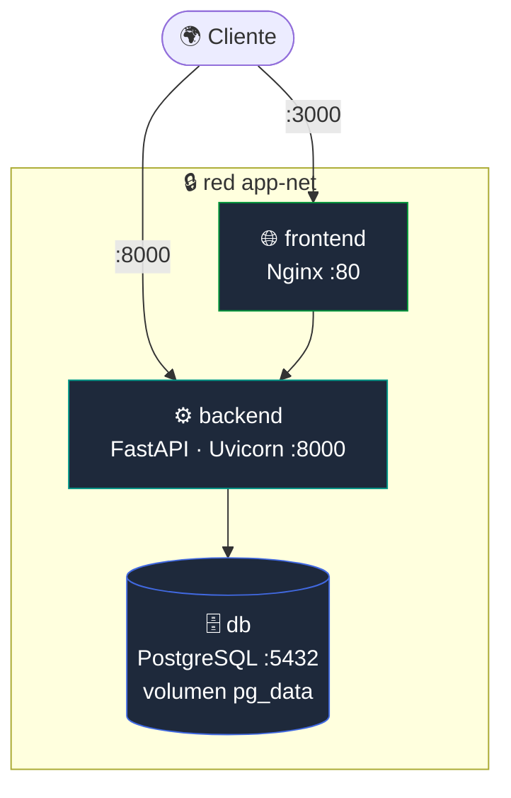

<div align="center">

# 🚀 Reservas Institucionales — Documentación de Despliegue

### Rama `ops` · Contenerización y operación con Docker

[](https://www.docker.com/)
[](https://docs.docker.com/compose/)
[](https://nginx.org/)
[](https://www.postgresql.org/)

</div>

> [!NOTE]
> Este README corresponde a la **rama de operaciones (`ops`)**. Documenta cómo **construir, desplegar y operar** el sistema con Docker en Linux o Windows (WSL). Para la documentación técnica del código consulta la rama [`dev`](../../tree/dev); para el manual de usuario, la rama [`main`](../../tree/main).

---

## 📑 Contenido

- [Requisitos previos](#-requisitos-previos)
- [Arquitectura de despliegue](#-arquitectura-de-despliegue)
- [Clonación y configuración](#-clonación-y-configuración)
- [Variables de entorno](#-variables-de-entorno)
- [Imágenes Docker](#-imágenes-docker)
- [docker-compose](#-docker-compose)
- [Puertos](#-puertos)
- [Construcción y ejecución](#-construcción-y-ejecución)
- [Verificación](#-verificación)
- [Operación: apagar, reiniciar, actualizar](#-operación-apagar-reiniciar-actualizar)
- [Solución de problemas](#-solución-de-problemas)

---

## ✅ Requisitos previos

| Herramienta | Versión mínima | Notas |
|---|---|---|
| Docker Engine | 24.x | En Windows usar **WSL 2** |
| Docker Compose | v2 (`docker compose`) | Incluido en Docker Desktop |
| Git | 2.x | Para clonar el repositorio |

> No necesitas instalar Python, Node.js ni PostgreSQL en el host: todo corre dentro de contenedores.

---

## 🏗️ Arquitectura de despliegue

Tres servicios orquestados por Docker Compose en una red privada (`app-net`); solo el frontend y el backend exponen puertos al host.



---

## 📥 Clonación y configuración

```bash
# 1. Clonar el repositorio y entrar a la rama ops
git clone https://github.com/Miguel-cast/Laboratorio-4.git
cd Laboratorio-4
git checkout ops

# 2. Crear el archivo de entorno a partir de la plantilla
cp .env.example .env
# Edita .env y cambia SECRET_KEY y las contraseñas para producción
```

---

## ⚙️ Variables de entorno

Definidas en `.env` (plantilla en `.env.example`). Las consume `docker-compose.yml`.

| Variable | Descripción | Default |
|---|---|---|
| `POSTGRES_USER` | Usuario de la base de datos | `postgres` |
| `POSTGRES_PASSWORD` | Contraseña de la base de datos | `admin123` |
| `POSTGRES_DB` | Nombre de la base de datos | `reservas_db` |
| `SECRET_KEY` | Clave para firmar el JWT — **cámbiala** | `cambia_esta_clave` |
| `ALGORITHM` | Algoritmo JWT | `HS256` |
| `ACCESS_TOKEN_EXPIRE_MINUTES` | Vigencia del token (min) | `60` |
| `ADMIN_EMAIL` / `ADMIN_PASSWORD` / `ADMIN_NOMBRE` | Admin inicial (seed) | `admin@correo.com` / `admin123` / `Administrador` |
| `BACKEND_URL` | URL del backend para el frontend | `http://localhost:8000` |

> En Docker, la `DATABASE_URL` del backend usa el host interno `@db:5432` (nombre del servicio en la red de Compose).

---

## 🐳 Imágenes Docker

| Archivo | Servicio | Base | Contenido |
|---|---|---|---|
| `Dockerfile.backend` | `backend` | `python:slim` | Instala `requirements.txt`, copia `app/`, ejecuta `init_db.py` y lanza **Uvicorn** |
| `Dockerfile.frontend` | `frontend` | `nginx:alpine` | Copia `frontend/` al servidor **Nginx** con `nginx.conf` |

---

## 📦 docker-compose

`docker-compose.yml` define los tres servicios:

| Servicio | Imagen | Detalle |
|---|---|---|
| **db** | `postgres:15-alpine` | Volumen `pg_data` para persistencia · **healthcheck** con `pg_isready` |
| **backend** | build `Dockerfile.backend` | Espera a que `db` esté *healthy* (`depends_on: condition: service_healthy`) |
| **frontend** | build `Dockerfile.frontend` | Depende de `backend` |

Incluye además la **red** `app-net` (bridge) y el **volumen** `pg_data`.

---

## 🔌 Puertos

| Servicio | Host | Contenedor | URL |
|---|:---:|:---:|---|
| Frontend (Nginx) | 3000 | 80 | http://localhost:3000 |
| Backend (FastAPI) | 8000 | 8000 | http://localhost:8000 |
| Swagger | 8000 | 8000 | http://localhost:8000/docs |
| PostgreSQL | — | 5432 | solo red interna |

---

## ▶️ Construcción y ejecución

```bash
# Construir e iniciar todo el sistema
docker compose up --build

# En segundo plano (detached)
docker compose up --build -d
```

El primer arranque tarda ~1–2 min: descarga imágenes base, instala dependencias, espera el *healthcheck* de PostgreSQL y ejecuta `init_db.py` (crea tablas y datos semilla).

---

## 🔎 Verificación

```bash
# Estado de los contenedores
docker compose ps

# Salud del backend
curl http://localhost:8000/

# Login del admin de prueba
curl -X POST http://localhost:8000/api/v1/auth/login \
  -d "username=admin@correo.com&password=admin123"
```

| Comprobación | Esperado |
|---|---|
| `http://localhost:3000` | Carga la pantalla de inicio de sesión |
| `http://localhost:8000/` | `{"mensaje":"API de Reservas funcionando"...}` |
| `http://localhost:8000/docs` | Swagger UI |

**Credenciales semilla:** `admin@correo.com / admin123` · `usuario@correo.com / usuario123`

---

## 🔄 Operación: apagar, reiniciar, actualizar

```bash
# Ver logs en tiempo real (todos / solo backend)
docker compose logs -f
docker compose logs -f backend

# Detener (conserva los datos)
docker compose down

# Detener y BORRAR la base de datos (¡destruye el volumen!)
docker compose down -v

# Reiniciar un servicio
docker compose restart backend

# Actualizar tras cambios de código
git pull
docker compose up --build -d
```

---

## 🩹 Solución de problemas

| Síntoma | Causa probable | Solución |
|---|---|---|
| `backend` sale con error de conexión a BD | La BD aún no está lista | El `healthcheck` lo maneja; espera unos segundos |
| Puerto 8000/3000 ocupado | Otro proceso usa el puerto | Cambia el mapeo en `docker-compose.yml` (`"8001:8000"`) |
| El frontend no conecta al backend | `BACKEND_URL` incorrecta | Verifica `.env` → `BACKEND_URL=http://localhost:8000` |
| Login falla desde el navegador | CORS | El backend ya tiene CORS abierto (`allow_origins=["*"]`) |
| Cambios del frontend no se ven | Caché del navegador | `Ctrl+Shift+R`, o `docker compose up --build -d frontend` |
| Cambios del backend no se ven | Imagen sin reconstruir | `docker compose up --build -d backend` |

---

<div align="center">
<sub>Rama <code>ops</code> · Documentación de despliegue · Aplicaciones y Servicios Web — Tecnología en Desarrollo de Software</sub>
</div>
