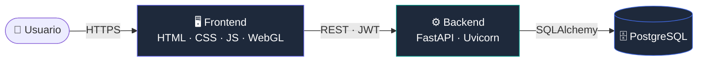
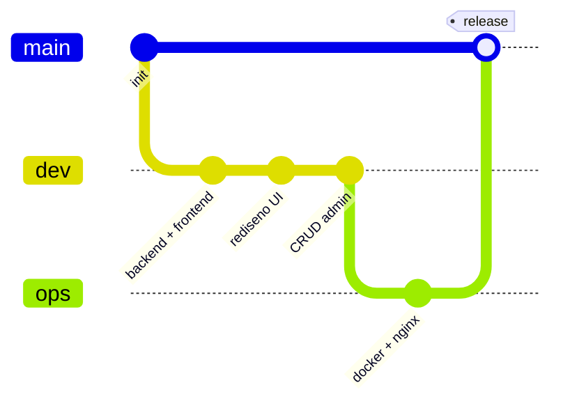

# 🏛️ Reservas Institucionales

### Plataforma web para la gestión inteligente de reservas de espacios institucionales

*Informe final y manual de usuario*

 

 

---

> [!NOTE]
> Este README de la rama **`main`** es el **informe final y manual de usuario** del proyecto. La documentación técnica está en la rama [`dev`](../../tree/dev) y la de despliegue en la rama [`ops`](../../tree/ops).

 

## 📑 Contenido

- [Descripción y objetivo](#-descripción-y-objetivo)
- [Integrantes del equipo](#-integrantes-del-equipo)
- [¿Qué hace y qué problema resuelve?](#-qué-hace-y-qué-problema-resuelve)
- [Arquitectura general y tecnologías](#-arquitectura-general-y-tecnologías)
- [Resumen del despliegue](#-resumen-del-despliegue)
- [Manual de uso](#-manual-de-uso)
- [Organización del repositorio](#-organización-del-repositorio)
- [Conclusiones y aprendizajes](#-conclusiones-y-aprendizajes)
- [Licencia](#-licencia)

 

## 🎯 Descripción y objetivo

**Reservas Institucionales** es una aplicación web full-stack que permite a una institución administrar la reserva de espacios —salas de reuniones, laboratorios, auditorios o aulas especiales— de forma centralizada, segura y trazable.

**Objetivo general:** desarrollar y desplegar una aplicación web para la gestión de reservas de espacios institucionales, integrando frontend, backend y base de datos mediante contenedores Docker, aplicando autenticación con JWT, control de acceso por roles y reglas de negocio.

 

## 👥 Integrantes del equipo

| Integrante | Rol principal | GitHub |
|:---|:---|:---:|
| **Juan Cardona** | Frontend · DevOps · Integración |  |
| **Miguel** | Backend · Base de datos |  |

> _Los roles reflejan el foco principal de cada integrante; el trabajo se integró de forma colaborativa mediante ramas y Pull Requests._

 

## ❓ ¿Qué hace y qué problema resuelve?

En muchas instituciones la reserva de espacios se gestiona de forma manual (correos, hojas de cálculo), lo que provoca **dobles reservas**, **solicitudes de último minuto**, **uso de espacios no disponibles** y **falta de trazabilidad**.

Esta plataforma centraliza el proceso y **valida automáticamente** cada solicitud:

<table>
<tr>
<td width="50%" valign="top">

#### 👤 El usuario puede
- Registrarse e iniciar sesión
- Explorar los espacios disponibles
- Crear reservas (validadas en el acto)
- Consultar el estado de sus solicitudes
- Cancelar sus reservas

</td>
<td width="50%" valign="top">

#### 🛡️ El administrador puede
- Aprobar o rechazar solicitudes
- Gestionar espacios (crear, editar, eliminar)
- Gestionar usuarios (crear, editar, eliminar)
- Editar reservas y ver todas las del sistema
- Consultar métricas en el panel

</td>
</tr>
</table>

 

## 🏗️ Arquitectura general y tecnologías

Arquitectura de **tres capas** contenerizadas, comunicadas por una API REST con autenticación JWT.

| Capa | Tecnologías |
|---|---|
| **Frontend** | HTML5, CSS3, JavaScript, Three.js (WebGL) |
| **Backend** | FastAPI, Uvicorn, SQLAlchemy, Pydantic, python-jose (JWT), passlib/bcrypt |
| **Base de datos** | PostgreSQL 15 |
| **DevOps** | Docker, Docker Compose, Nginx |

 

## ☁️ Resumen del despliegue

El sistema se despliega con **Docker Compose** en Linux o Windows (WSL), orquestando tres contenedores —frontend (Nginx), backend (FastAPI) y base de datos (PostgreSQL)— en una red privada con un volumen persistente para los datos.

| Servicio | URL |
|---|---|
| Frontend | http://localhost:3000 |
| Backend / API | http://localhost:8000 |
| Documentación (Swagger) | http://localhost:8000/docs |

> 🔧 Los pasos detallados de construcción, ejecución y operación están en la rama [`ops`](../../tree/ops).

 

## 📖 Manual de uso

> 🖼️ _Las siguientes imágenes son marcadores. Reemplaza cada URL por una captura real del sistema (sugerencia: súbelas a una carpeta `docs/img/` del repositorio)._

### 1. Inicio de sesión y registro
Accede con tu correo y contraseña. Si no tienes cuenta, regístrate desde el enlace inferior.

### 2. Panel principal (dashboard)
Tras iniciar sesión verás el panel con un resumen de tu actividad y la navegación por pestañas.

### 3. Consultar espacios y crear una reserva
En **Espacios** explora los disponibles y pulsa **Reservar**: elige fecha, horario y número de asistentes. El sistema valida las reglas de negocio en el momento.

### 4. Consultar y cancelar tus reservas
En **Mis reservas** revisas el estado de cada solicitud (esperando, aprobada, rechazada) y puedes cancelarlas.

### 5. Gestión de espacios y aprobación (administrador)
El administrador crea/edita/elimina espacios y **aprueba o rechaza** las reservas pendientes.

### 6. Gestión de usuarios (administrador)
Desde **Usuarios**, el administrador crea, edita y elimina cuentas, asignando el rol correspondiente.

### 7. Mensajes de error y cierre de sesión
Cuando una reserva incumple una regla, el sistema muestra un mensaje claro. Para salir, usa el botón de cerrar sesión.

> **Credenciales de prueba:** `admin@correo.com / admin123` (administrador) · `usuario@correo.com / usuario123` (usuario).

 

## 🌳 Organización del repositorio

El proyecto sigue una estrategia de ramas inspirada en **Git Flow**:

| Rama | Contenido | README |
|---|---|---|
| 🟣 [`main`](../../tree/main) | Integración final · versión estable | Informe y manual de usuario |
| 🔵 [`dev`](../../tree/dev) | Desarrollo de frontend y backend | Documentación técnica |
| 🟢 [`ops`](../../tree/ops) | Configuración de despliegue | Documentación de despliegue |

 

## 🧠 Conclusiones y aprendizajes

#### ✅ Conclusiones
- Se desarrolló y desplegó una aplicación web **funcional y completa** que integra frontend, backend y base de datos en contenedores.
- La separación en capas y la **arquitectura modular** del backend facilitaron implementar autenticación, roles y un motor de **9 reglas de negocio** mantenibles.
- El uso de **Docker Compose** hizo el despliegue **reproducible** y consistente entre entornos.

#### 🧩 Dificultades
- Coordinar las **reglas de negocio** de las reservas (solapamientos, anticipación, horarios) y revalidarlas también al **editar**.
- Manejar el **flujo de autenticación JWT** entre frontend y backend (almacenamiento del token, expiración, control por rol).
- Orquestar la **comunicación entre contenedores** y los tiempos de arranque (healthcheck de la base de datos).

#### 📚 Aprendizajes
- Diseño e implementación de una **API REST** segura con FastAPI y validación con Pydantic.
- Autenticación y autorización con **JWT** y control de acceso por roles.
- Contenerización y orquestación de servicios con **Docker** y **Docker Compose**.
- Trabajo colaborativo con **Git/GitHub** mediante ramas y Pull Requests.

#### 🚀 Mejoras futuras
- Notificaciones por correo al aprobar/rechazar reservas.
- Calendario visual de disponibilidad por espacio.
- Paginación y búsqueda en los listados.
- Pruebas automatizadas (unitarias e integración) y CI/CD.

 

## 📄 Licencia

Distribuido bajo la licencia **MIT**. Consulta el archivo [`LICENSE`](LICENSE).

---

**Desarrollado para la asignatura de Aplicaciones y Servicios Web**

Tecnología en Desarrollo de Software · Laboratorio Integrador DevOps

