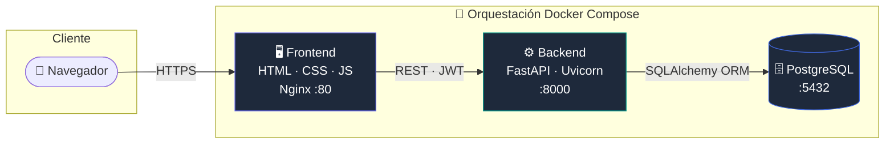
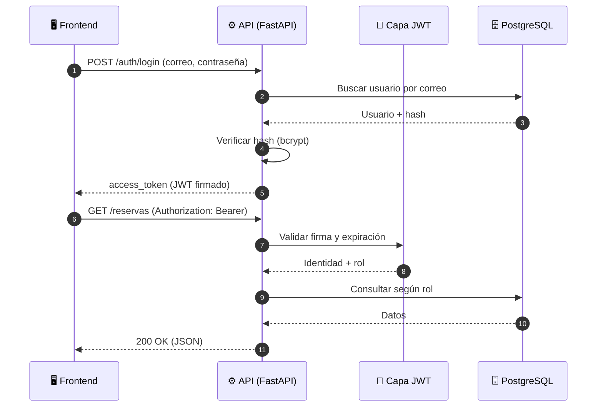
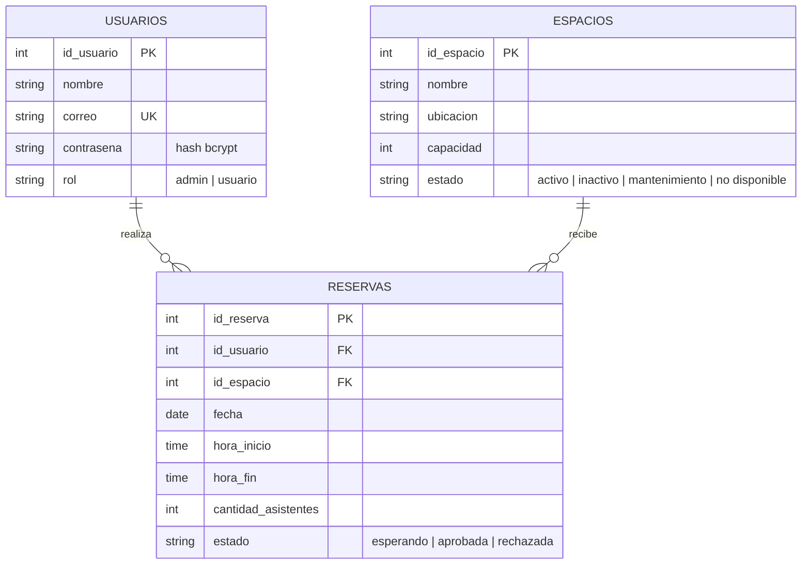
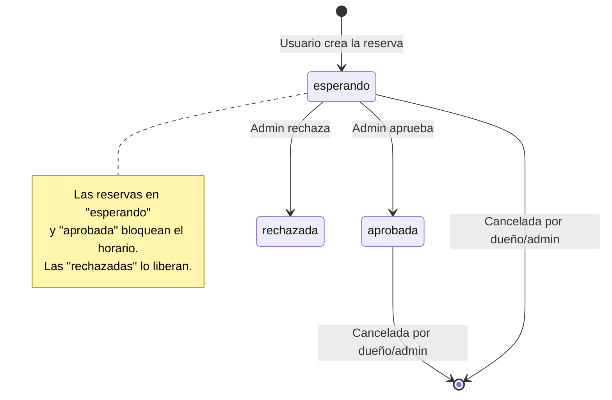
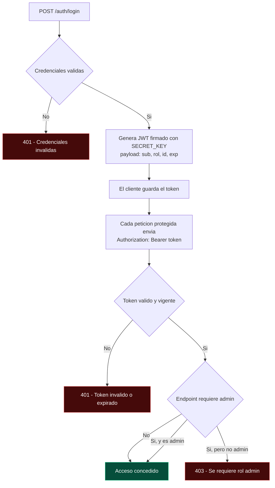
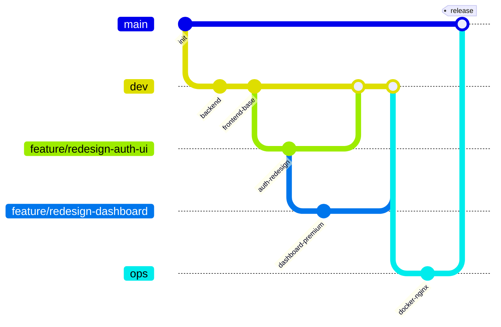
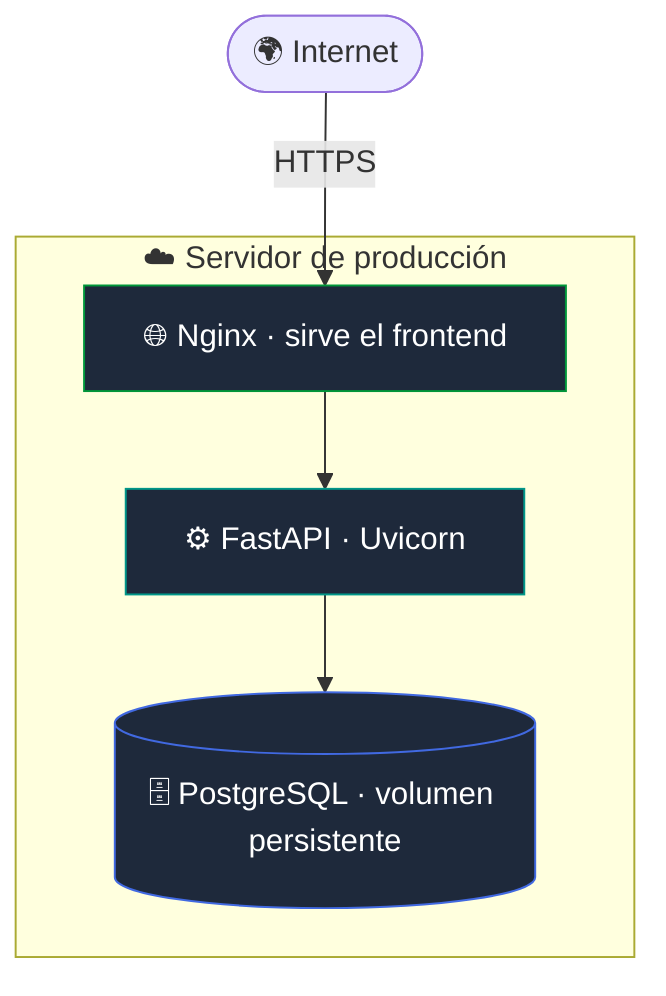

<div align="center">

# 🏛️ Reservas Institucionales

### Plataforma web para la gestión inteligente de reservas de espacios institucionales

*Autenticación con JWT · Control de acceso por roles · Reglas de negocio · Despliegue en contenedores*

<br/>

[](https://fastapi.tiangolo.com/)
[](https://www.python.org/)
[](https://www.postgresql.org/)
[](https://www.docker.com/)
[](https://jwt.io/)
[](https://threejs.org/)

<br/>

[](#-despliegue)
[](#-arquitectura)
[](#-api-rest)
[](#-licencia)

</div>

---

> [!NOTE]
> Este documento describe **la arquitectura, el diseño y la ingeniería** del proyecto. La aplicación se ejecuta **desplegada en contenedores sobre un servidor**, por lo que no requiere instalación local para ser utilizada — basta con acceder a la URL de producción.

<br/>

## 📑 Tabla de contenido

- [✨ Visión general](#-visión-general)
- [🎯 El problema que resuelve](#-el-problema-que-resuelve)
- [🚀 Características](#-características)
- [🏗️ Arquitectura](#-arquitectura)
- [🧱 Stack tecnológico](#-stack-tecnológico)
- [🗃️ Modelo de datos](#-modelo-de-datos)
- [📐 Reglas de negocio](#-reglas-de-negocio)
- [🔌 API REST](#-api-rest)
- [🔐 Autenticación y autorización](#-autenticación-y-autorización)
- [🎨 Experiencia de usuario](#-experiencia-de-usuario)
- [🗂️ Estructura del proyecto](#-estructura-del-proyecto)
- [🌳 Flujo de trabajo Git](#-flujo-de-trabajo-git)
- [☁️ Despliegue](#-despliegue)
- [👥 Equipo](#-equipo)
- [📄 Licencia](#-licencia)

<br/>

## ✨ Visión general

**Reservas Institucionales** es una aplicación web full-stack que permite a una institución administrar la reserva de espacios —salas de reuniones, laboratorios, auditorios o aulas especiales— evitando conflictos de horario, solicitudes fuera del horario permitido y reservas con poca anticipación.

El sistema está construido sobre una **arquitectura de tres capas** desacoplada y contenerizada, con una **API REST** segura, **autenticación basada en JWT**, **control de acceso por roles** y un conjunto de **reglas de negocio** que garantizan la integridad de cada reserva.

<div align="center">

| 🧩 Componente | 💼 Responsabilidad |
|:---|:---|
| **Frontend** | Interfaz reactiva que consume la API y adapta sus vistas según el rol |
| **Backend** | API REST que aplica autenticación, autorización y reglas de negocio |
| **Base de datos** | Persistencia relacional de usuarios, espacios y reservas |

</div>

<br/>

## 🎯 El problema que resuelve

En muchas instituciones la reserva de espacios se gestiona de forma manual (correos, hojas de cálculo, mensajería), lo que genera:

- ❌ **Dobles reservas** sobre el mismo espacio y horario.
- ❌ **Solicitudes de último minuto** imposibles de coordinar.
- ❌ **Uso de espacios** en mantenimiento o no disponibles.
- ❌ **Falta de trazabilidad** sobre quién reservó qué y cuándo.

Esta plataforma centraliza el proceso y **valida automáticamente** cada solicitud contra un motor de reglas, dejando un registro auditable y un flujo de aprobación claro.

<br/>

## 🚀 Características

<table>
<tr>
<td width="50%" valign="top">

#### 👤 Para usuarios
- 🔑 Registro e inicio de sesión seguro
- 🏢 Exploración de espacios disponibles
- 📅 Creación de reservas con validación en tiempo real
- 📋 Seguimiento del estado de sus solicitudes
- 🚫 Cancelación de reservas propias

</td>
<td width="50%" valign="top">

#### 🛡️ Para administradores
- ✅ Aprobación / rechazo de solicitudes
- 🏗️ Gestión completa de espacios (CRUD)
- 👥 Administración de usuarios
- 📊 Panel con métricas en vivo
- 🔍 Visibilidad de todas las reservas

</td>
</tr>
</table>

#### ⚙️ Características transversales

`API REST` · `JWT con expiración` · `Hash de contraseñas con bcrypt` · `Validación de 9 reglas de negocio` · `Documentación interactiva (Swagger/OpenAPI)` · `Interfaz animada con WebGL` · `Despliegue reproducible con Docker Compose`

<br/>

## 🏗️ Arquitectura

El sistema sigue una arquitectura de **tres capas** desacopladas, cada una en su propio contenedor, comunicadas a través de una red privada de Docker.



#### Flujo de una petición autenticada



<br/>

## 🧱 Stack tecnológico

<div align="center">

| Capa | Tecnología | Propósito |
|:---|:---|:---|
| **Backend** |  | Framework web asíncrono y API REST |
| |  | Servidor ASGI de alto rendimiento |
| |  | ORM y capa de acceso a datos |
| |  | Validación y serialización de esquemas |
| **Seguridad** |  | Emisión y validación de tokens JWT |
| |  | Hash seguro de contraseñas |
| **Base de datos** |  | Motor relacional |
| **Frontend** |    | Interfaz sin frameworks pesados |
| |  | Fondo animado con shaders WebGL |
| **DevOps** |   | Contenerización y servidor estático |

</div>

<br/>

## 🗃️ Modelo de datos

Tres entidades principales relacionadas mediante claves foráneas: un usuario puede tener muchas reservas y un espacio puede recibir muchas reservas.



#### Ciclo de vida de una reserva



<br/>

## 📐 Reglas de negocio

El backend valida **cada reserva** contra el siguiente motor de reglas antes de persistirla. Si alguna falla, responde con un mensaje claro y un código de error apropiado.

| # | Regla | Validación |
|:---:|:---|:---|
| **1** | 🔓 Solo usuarios autenticados pueden crear reservas | Token JWT válido |
| **2** | 👮 Solo `admin` puede aprobar o rechazar | Autorización por rol |
| **3** | 🚫 Sin solapamientos | No se permite reservar un espacio ya ocupado en esa fecha y franja horaria |
| **4** | ⏰ Anticipación mínima | La reserva debe hacerse con **≥ 24 horas** de antelación |
| **5** | 📅 Horario permitido | Lun–Vie **7:00–20:00** · Sáb **8:00–12:00** · Dom **cerrado** |
| **6** | ↔️ Coherencia horaria | `hora_inicio` debe ser **menor** que `hora_fin` |
| **7** | 🛠️ Espacios disponibles | No se reservan espacios `inactivo`, `en mantenimiento` o `no disponible` |
| **8** | 👥 Aforo | La cantidad de asistentes no puede **superar la capacidad** del espacio |
| **9** | 🏷️ Estado inicial | Toda reserva nace en `esperando`; solo `admin` la cambia a `aprobada`/`rechazada` |

<br/>

## 🔌 API REST

Base URL: `/api/v1` · Documentación interactiva autogenerada en `/docs` (Swagger UI) y `/redoc`.

<details open>
<summary><b>🔑 Autenticación</b> &nbsp;<code>/auth</code></summary>

<br/>

| Método | Endpoint | Descripción | Acceso |
|:---:|:---|:---|:---:|
| `POST` | `/auth/register` | Registra un nuevo usuario | 🌐 Público |
| `POST` | `/auth/login` | Inicia sesión y devuelve un JWT | 🌐 Público |

</details>

<details>
<summary><b>👥 Usuarios</b> &nbsp;<code>/usuarios</code></summary>

<br/>

| Método | Endpoint | Descripción | Acceso |
|:---:|:---|:---|:---:|
| `GET` | `/usuarios/` | Lista todos los usuarios | 🛡️ Admin |
| `GET` | `/usuarios/{id}` | Obtiene un usuario | 🛡️ Admin |
| `PUT` | `/usuarios/{id}` | Actualiza un usuario | 🛡️ Admin |
| `DELETE` | `/usuarios/{id}` | Elimina un usuario | 🛡️ Admin |

</details>

<details>
<summary><b>🏢 Espacios</b> &nbsp;<code>/espacios</code></summary>

<br/>

| Método | Endpoint | Descripción | Acceso |
|:---:|:---|:---|:---:|
| `POST` | `/espacios/` | Crea un espacio | 🛡️ Admin |
| `GET` | `/espacios/` | Lista los espacios | 🔒 Autenticado |
| `GET` | `/espacios/{id}` | Detalle de un espacio | 🔒 Autenticado |
| `PUT` | `/espacios/{id}` | Actualiza un espacio | 🛡️ Admin |
| `DELETE` | `/espacios/{id}` | Elimina un espacio | 🛡️ Admin |

</details>

<details>
<summary><b>📅 Reservas</b> &nbsp;<code>/reservas</code></summary>

<br/>

| Método | Endpoint | Descripción | Acceso |
|:---:|:---|:---|:---:|
| `POST` | `/reservas/` | Crea una reserva (valida las 9 reglas) | 🔒 Autenticado |
| `GET` | `/reservas/` | Lista reservas (admin: todas · usuario: las suyas) | 🔒 Autenticado |
| `GET` | `/reservas/{id}` | Detalle de una reserva | 🔒 Autenticado |
| `PUT` | `/reservas/{id}/estado` | Aprueba o rechaza | 🛡️ Admin |
| `DELETE` | `/reservas/{id}` | Cancela una reserva | 🔒 Dueño o Admin |

</details>

<br/>

## 🔐 Autenticación y autorización



- **Contraseñas** almacenadas con hash **bcrypt** (nunca en texto plano).
- **Tokens JWT** firmados con `HS256` y **expiración configurable**.
- Dependencias de FastAPI `get_current_user` y `require_admin` protegen cada endpoint.

<br/>

## 🎨 Experiencia de usuario

La interfaz fue diseñada con un lenguaje visual **premium y oscuro**, priorizando la claridad y el detalle:

- 🌌 **Pantallas de acceso** con fondo animado de matriz de puntos renderizado por **shaders WebGL** (Three.js).
- 🪄 **Dashboard** con _aurora_ animada, tarjetas _glassmorphism_, entrada escalonada y micro-interacciones.
- 📊 **Métricas en vivo** con animación de conteo.
- 🔔 **Notificaciones tipo toast**, **modales** animados y **skeleton loaders**.
- 📱 **Diseño responsivo** y accesible.

> Las vistas se adaptan dinámicamente según el rol: un usuario ve sus reservas y los espacios disponibles; un administrador obtiene además paneles de gestión y aprobación.

<br/>

## 🗂️ Estructura del proyecto

```
Reservas-Institucionales/
├── app/                        # ⚙️ Backend (FastAPI)
│   ├── api/                    #   Routers / endpoints
│   │   ├── auth.py             #     Login y registro
│   │   ├── usuarios.py         #     CRUD de usuarios
│   │   ├── espacios.py         #     CRUD de espacios
│   │   └── reservas.py         #     CRUD + flujo de reservas
│   ├── models/                 #   Modelos SQLAlchemy (ORM)
│   ├── schemas/                #   Esquemas Pydantic (validación)
│   ├── crud/                   #   Lógica de acceso a datos + reglas de negocio
│   ├── auth/                   #   Emisión y verificación de JWT
│   ├── db.py                   #   Conexión y sesión de base de datos
│   └── main.py                 #   Punto de entrada, routers y CORS
│
├── frontend/                   # 🖥️ Cliente (HTML · CSS · JS)
│   ├── index.html              #   Inicio de sesión
│   ├── register.html           #   Registro
│   ├── dashboard.html          #   Panel principal
│   ├── auth.js · api.js        #   Lógica de auth y capa de API
│   ├── dashboard.js            #   Interacción del panel
│   ├── canvas-bg.js            #   Fondo WebGL (shaders)
│   ├── style.css · dashboard.css
│   └── config.js               #   Configuración del cliente
│
├── init_db.py                  # 🌱 Inicialización y datos semilla
├── requirements.txt            # 📦 Dependencias Python
├── docker-compose.yml          # 🐳 Orquestación de servicios
├── Dockerfile.backend          #   Imagen del backend
├── Dockerfile.frontend         #   Imagen del frontend (Nginx)
└── nginx.conf                  #   Configuración del servidor web
```

<br/>

## 🌳 Flujo de trabajo Git

El repositorio sigue una estrategia de ramas inspirada en **Git Flow**, con separación clara entre desarrollo, operaciones e integración final.



<div align="center">

| Rama | Propósito |
|:---|:---|
| 🟣 `main` | Integración final y versión estable desplegada |
| 🔵 `dev` | Desarrollo activo del frontend y backend |
| 🟢 `ops` | Configuración de despliegue (Docker, Nginx, variables) |
| 🌿 `feature/*` | Funcionalidades aisladas, integradas vía Pull Request |

</div>

> Cada funcionalidad se desarrolla en su propia rama `feature/*` y se integra a `dev` mediante **Pull Requests** revisados, garantizando un historial limpio y trazable.

<br/>

## ☁️ Despliegue

La aplicación está **contenerizada y desplegada** sobre un servidor mediante **Docker Compose**, que orquesta tres servicios aislados en una red privada:



- 🔄 **Reproducible:** un único `docker compose up` levanta todo el sistema.
- 🔒 **Aislado:** la base de datos solo es accesible desde la red interna.
- 💾 **Persistente:** los datos sobreviven a reinicios mediante volúmenes.
- 🩺 **Resiliente:** _health checks_ y políticas de reinicio automático.

> 🔗 **Acceso:** la plataforma se consume directamente desde la URL de producción. _(La documentación operativa detallada se encuentra en la rama `ops`.)_

<br/>

## 👥 Equipo

<div align="center">

| Integrante | GitHub |
|:---|:---:|
| Juan Cardona | [](https://github.com/Juanka690) |
| Miguel | [](https://github.com/Miguel-cast) |

</div>

<br/>

## 📄 Licencia

Distribuido bajo la licencia **MIT**. Consulta el archivo `LICENSE` para más información.

---

<div align="center">

**Desarrollado con ❤️ para la asignatura de Aplicaciones y Servicios Web**

<sub>Tecnología en Desarrollo de Software · Laboratorio Integrador DevOps</sub>

</div>
